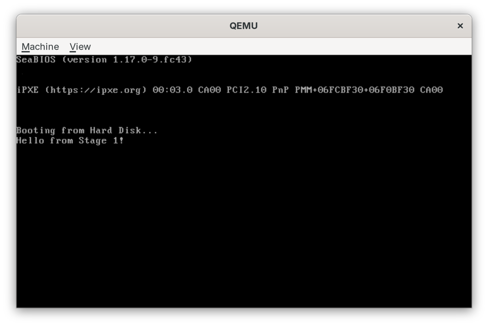
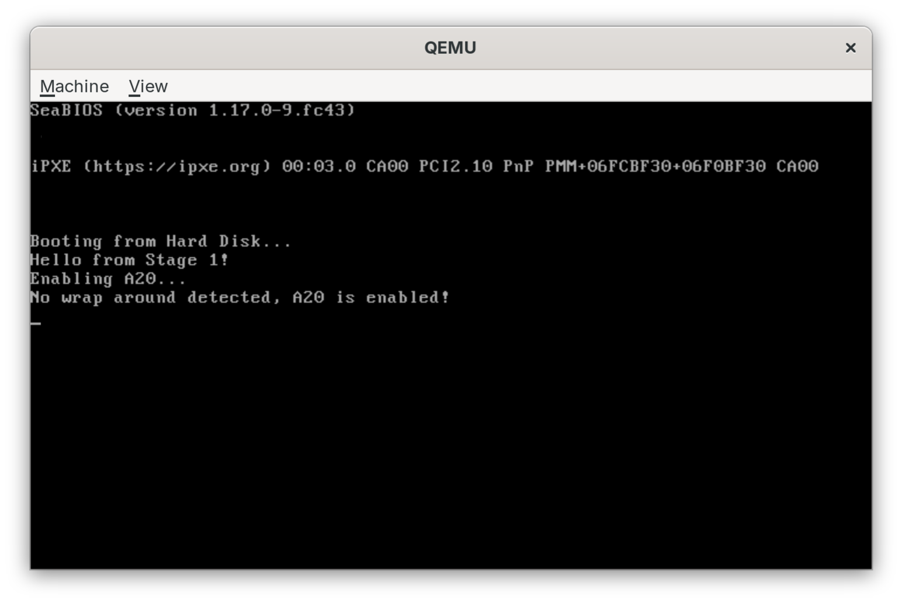
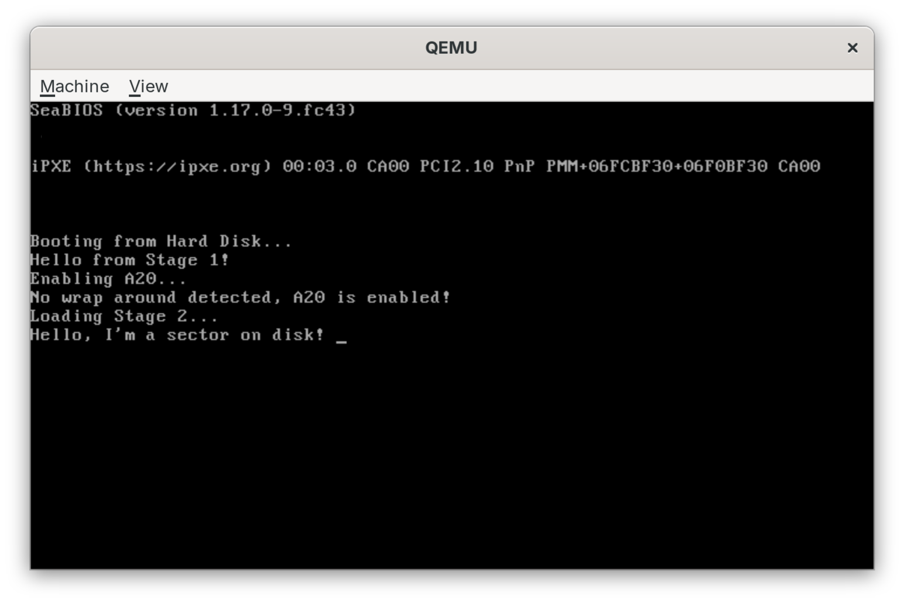
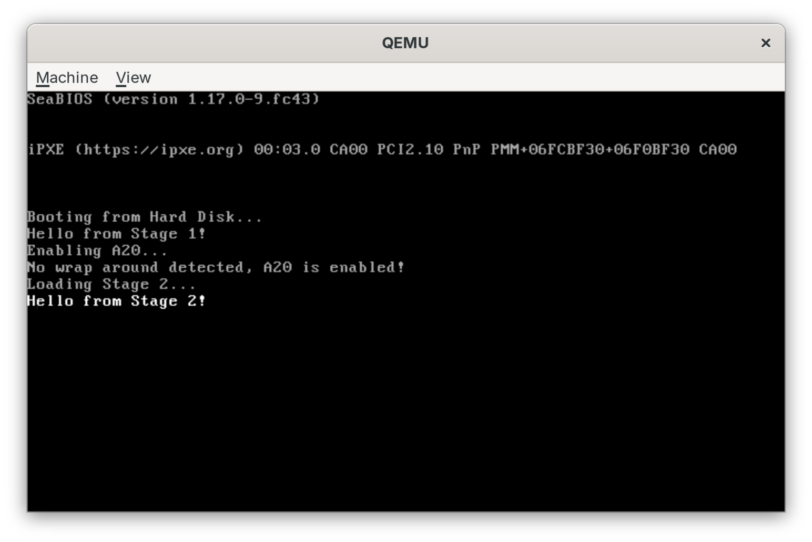

# Make Your Own BIOS Bootloader Workshop

Welcome to the **"Make Your Own BIOS Bootloader"** workshop! In this session, you will build a legacy BIOS bootloader from scratch using x86 assembly and C.

## 📁 Project Structure

```
bios-workshop/
├── slides/
│   └── slides.typ       # Workshop slides (Typst)
├── stage1/
│   └── boot.asm         # Stage 1 Bootloader (16-bit Assembly)
├── stage2/
│   ├── main.c           # Stage 2 (32-bit C program)
│   └── linker.ld        # Linker Script
├── build/               # Build artifacts (created during build)
├── Makefile             # Build automation
└── README.md            # This guide
```

## 🛠️ Prerequisites

You need the following tools installed:

*   **NASM**: The Netwide Assembler
*   **GCC**: The GNU Compiler Collection (cross-compiler for i386 if on non-x86)
*   **QEMU**: To emulate an x86 PC
*   **Make**: To automate the build

### Installation

#### Linux (Debian/Ubuntu)
```bash
sudo apt update
sudo apt install nasm gcc make qemu-system-x86
```

#### Linux (Fedora)
```bash
sudo dnf install nasm gcc make qemu-system-x86
```

#### macOS (Apple Silicon & Intel)
Install via Homebrew:
```bash
brew install nasm make qemu
```
**Important:**
The default `gcc` (clang) cannot produce 32-bit x86 code. You **must** use a cross-compiler:
```bash
brew install x86_64-elf-gcc
```
*Note: You will need to update the `Makefile` to use `x86_64-elf-gcc` and `x86_64-elf-ld` instead of `gcc` and `ld`.*

#### Windows

> [!NOTE]
> These instructions are provided as a "best effort" guide. As the author does not use Windows, consider this a homework exercise to figure out the exact details! :)

**Recommended: MSYS2**

[MSYS2](https://www.msys2.org/) provides a modern Unix-like environment on Windows and is the easiest way to get the required tools.

1.  **Install MSYS2** from the official website.
2.  **Open the MSYS2 UCRT64 terminal** and install the necessary packages:
    ```bash
    pacman -S mingw-w64-ucrt-x86_64-gcc \
              mingw-w64-ucrt-x86_64-nasm \
              mingw-w64-ucrt-x86_64-make \
              mingw-w64-ucrt-x86_64-qemu \
              git
    ```
3.  **Use `mingw32-make`** (installed with the make package) to build and run:
    ```bash
    mingw32-make run
    ```

**Alternative: WSL2**
1.  Install WSL2 (Ubuntu).
2.  Follow the **Linux (Debian/Ubuntu)** instructions above inside the WSL terminal.
3.  *Note:* You will need [WSLg](https://github.com/microsoft/wslg) (standard in Windows 11) or an X server (like VcXsrv) to see the QEMU VGA window. Without a display server, you won't see the VGA output.

## 🚀 Build & Run

To build the project and run it in QEMU:

```bash
make run
```

To just build without running:

```bash
make
```

To clean up build artifacts:

```bash
make clean
```

## 📚 Workshop Guide

You can use the resources in this repo however you like to build your own
stage1 and stage2 bootloader, and then even move on from there to make a proper
operating system, in a "build your own adventure style".

At the bottom, you will find the overall [architectural overview](#architectural-overview) of the author's
implementation. You can use it as a reference or example of how to do things,
and you can also keep it for last to read if you want to guess the answers to
all the steps on your own.

Here is an example for a bottom up adventure that builds incrementally on top
of previous steps.

### Exercise 1: Stage 1 Hello World!

For this exercise, you will write a small, 16-bit x86 assembly program that will
use BIOS interrupt service `int=10h/AH=10h` to write a simple "Hello World!"
message to the screen.

I won't spoil the fun for you of figuring out exactly how, but I will give you
some commands and instructions to test your code:
 - `nasm -f bin stage1/boot.asm -o build/boot.bin` to build the binary
 - `qemu-system-i386 -drive format=raw,file=build/boot.bin` to run it

On my machine, it will look like this:



### Exercise 2: Check A20 gate

For this exercise, you will expand on the previous one to check if address line
A20 is enabled or disabled, and if disabled, you will enabled it.

There are many ways to check if A20 is enabled, you can find some on OsDev
Wiki. In its simplest form, it's a matter of: writing a value to one of two
segment addresses that will point to the same physical address if A20 is
disabled (e.g. `0x0000:0x0000` and `0xf800:8000`), and check if reading from
the other address gives you the same value you wrote in the other one.

Likewise, there are also many ways to enable A20, which you can also find
on OsDev Wiki. Up to you to figure one you like and use it!

It might look somewhat like this:



### Exercise 3: Loading Stage 2 into memory

For this exercise, you will expand on the previous one to read the sectors on
the boot drive that contain your stage 2.

Stage 2 can be anything, literally a "Hello World" string. Of course, it's nice
when it's an actual piece of code that load an operating system, but that's a
matter of opinions :).

For this exercise, you can take it easy and not worry about setting up a proper
payload to be loaded and run into memory, you can just make a binary file that
contains the bytes of "Hello, I'm a sector on disk!" followed by `\0`, and
print it. Setting the stage up to read sectors using BIOS interrupt `INT
13h/AH=02h`, and figuring out how to assemble everything into a proper disk
image is enough work already. We will worry about setting up a proper payload
in later exercises.

Friendly reminder of the command you will want to be able to run:
 - `qemu-system-i386 -drive format=raw,file=build/disk.img`

It might look somewhat like this:


### Exercise 4: Stage 2 payload

In this exercise you will create the actual stage 2 payload in the form of a
freestanding C program compiled to 32-bit.

gcc by default doesn't just take C source and turn it into instruction followed
by data, it creates what is called a ELF file, which is a richer format for
loading, linking, and executing binaries.

However, too rich for our taste! We want a simple binary containing machine
instructions that we can plain load into memory from disk, and hand execution
over to! For that, we will want to ask gcc, and more specifically the linker,
to "assemble" its output into our desired format. That is what a linker script
is for! Sometimes some snipping and trimming around with `objcopy` can also do
the trick :).

Your payload can do anything you want, mostly, but in our execution environment
we do have some "limitations" compared to writing a program that will run on
top of an OS. Something simple I recommend for your payload: a program that
writes to screen by interacting with the VGA controller, memory mapped
conventionally at `0xb000`.

An example command you can run to create such a payload with gcc:
  - `gcc -m32 -ffreestanding -c -g -Os -Wall -Wextra -fno-pie -fno-stack-protector stage2/main.c -o build/stage2.o`, followed by:
  - `ld -m elf_i386 -T stage2/linker.ld --oformat binary -o build/stage2.bin build/stage2.o`

A few things to keep in mind for this exercise:
  - Time to learn about `volatile` memory accesses if you haven't already
  - Be mindful of the loading address! Compilers like gcc have all sorts of
    provision that make compiling single units separately, and then assembling
    into a final binary easier (a process known as linking). To that end, they
    might bake memory addresses in their output that are not "real" memory
    addresses, but more like placeholders that will be relocated later on by the
    linker before making the final binary.

    That is our enemy here: we don't want any of that flexibility, and we must
    make sure that our final binary is "compatible" with the fact that it will be
    loaded at a fixed address in memory (the one you load your stage2 sectors to).

    There are many ways to skin this cat, what you can find in `./stage2` is just
    an example. Have fun with it in your own way :)

### Exercise 4: Setting up the GDT

To go into 32-bit mode, we need to set up the Global Descriptor Table so we can
activate Protected Mode. This is also where we set things up so that we don't
need to actively think about segments anymore, and memory becomes a flat,
linear array of bytes.

This exercise does not have a strong visual component, basically your output
here will be verified by the final exercise really (and if things go wrong
here, you might need to resort to Bochs to debug issues, bearing in mind that
Bochs is a fantastic emulator + debugger piece of software, but it is sometime
a lot more forgiving than qemu, so the same code might work in Bochs and not in QEMU).

### Exercise 5: Enable Protected Mode and far jump to stage2

This is the final exercise, where it all comes together: enable protected mode,
and make the final far jump to the piece of code that will then call your
kernel. This small snippet will run in 32-bit protected mode if you did your
work correctly in the previous exercise. From here, you will be able to jump to
stage2, by calling/jumping the address you loaded your stage2 sectors to.

This is an example of what it looks like on my machine:



## Architectural overview

This is just a toy example of how one would go about building a bootloader
somewhere around the 90's, but in its simplicitity, it illustrates many of the
quirks of the x86 architecture that still exist on our machines to this day,
and is a good starting point to learn the evolution of x86 from the start (I
would argue this project counts both as a low-level hacking project, as well as
a history/rediscovery project).

This is the overview of what happens when you run `make run`:

### Step 1: The Boot Sector (Stage 1)
The BIOS loads the first 512 bytes of the boot disk to memory address `0x7C00`.
We use `INT 0x10, AX=0x1301` to print strings directly to the screen using BIOS services.
We must:
1.  Set up the stack.
2.  Enable the A20 line (to access memory > 1MB).
3.  Load Stage 2 from the disk into memory.
4.  Switch to Protected Mode (32-bit).

See `stage1/boot.asm`.

### Step 2: Stage 2
Once in 32-bit Protected Mode, we can use C!
We use a special linker section `.text.entry` to ensure our `entrypoint()` function is the first code executed.
We write directly to the VGA video memory at `0xB8000` to display text.

In a traditional bootloader, this is where you would do your stage 2 tasks that
didn't fit in the MBR (e.g. setting up paging, the TSS, extended mode, aka
64-bit more, etc.), but nothing stops you from writing you entire 32-bit
operating system here.


> [!TIP]
> Pop quiz: what do you think will happen when your stage 2 gets too big with our current disk load subroutine in stage1? :)

See `stage2/main.c`.

### Step 3: Linking
We need a "flat binary" (no ELF/PE headers) because the BIOS doesn't understand executable formats. We use a linker script to place our code at the correct memory address (`0x1000`).

See `stage2/linker.ld`.
